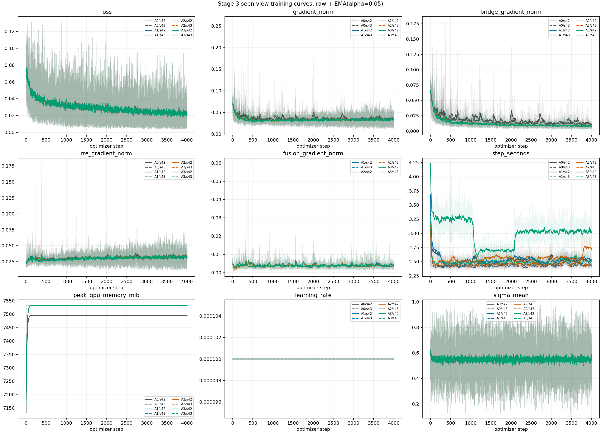
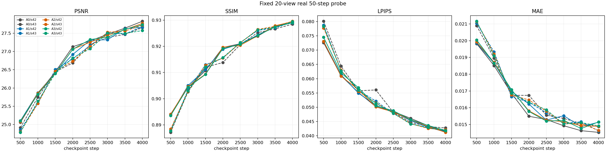
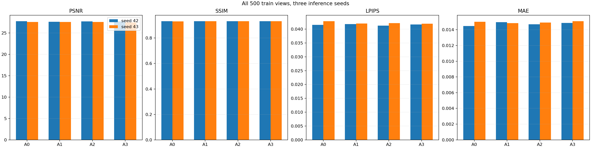
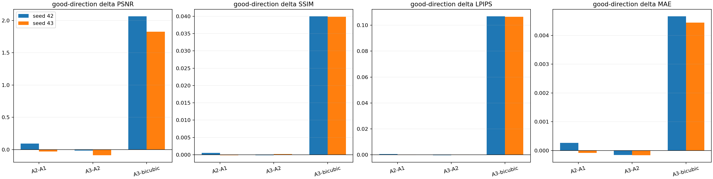

# Stage 3 训练视图 SR 有效性报告

## 结论

- `SR_FIT_PASS`: **True**
- `CROSS_VIEW_PASS`: **False**
- `GEOMETRY_PASS`: **False**
- `SEEN_SR_EFFECTIVE`: **False**

本报告只判断五个共享训练场景中官方 train 视图的 SR 拟合与因果使用，不判断未见视图、未见场景、新视角合成、3DGS 或三维一致性。

## 定量结果

场景等权结果、逐 seed 对照、干预差值和重复运行抖动见 `summary.json` 与 `summary_rows.csv`。正向差值统一表示候选更好。

## 判定规则

- 两个训练 seed 必须方向一致；PSNR 增益必须超过相同输入重复解码的最大抖动。
- SSIM 不下降，LPIPS 与 MAE 不恶化；不设置额外 0.1/0.2 dB 门槛。
- A2-A1 判断跨视角信息，A3-A2 与正确/打乱 fusion-camera 判断几何贡献。
- 任一关口失败均保持原结论，不追加调参或修改阈值。
