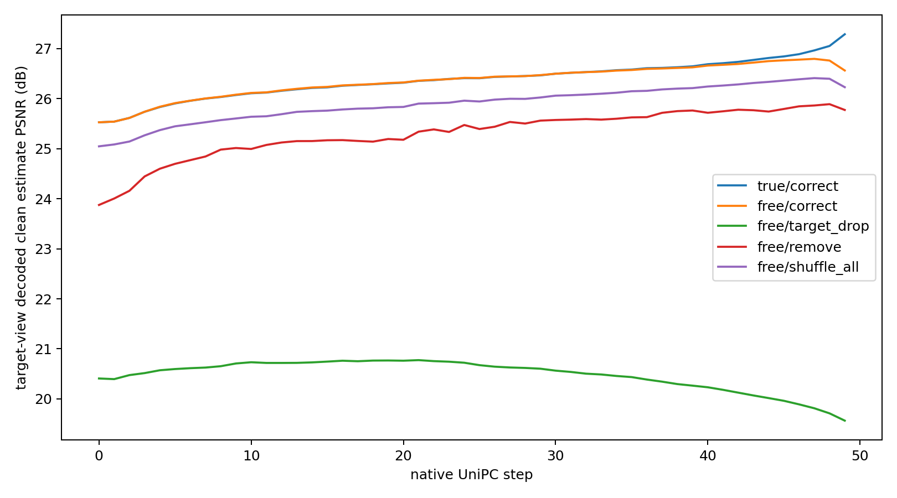
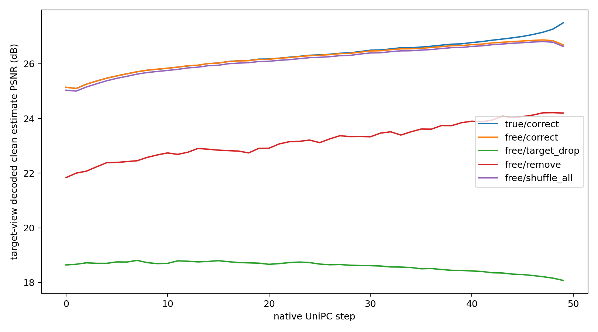
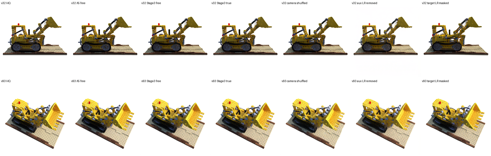

# Stage 3 原生 50 步采样轨迹诊断

**结论（2026-09-28）：Stage 3 相对匹配 A5 的质量差距，主要已出现在正确加噪状态的低噪声预测中；没有达到预先设定的“连续轨迹误差累积”门槛。** 两个模型在最后一步都出现自由轨迹与正确状态预测的差距，但 Stage 3 的差距还略小于 A5。当前不启动四步模型生成状态监督训练，不增加相机损失，也不放行 Stage 4。

## 1. 协议和数据完整性

- 模型：`full_ordinary` 第 4000 步与匹配 A5 第 4000 步。两者架构、训练历史和损失并不完全相同，本次模型间比较用于定位误差段落，不是单一因素消融。
- 输入：已有 Lego 训练场景的固定 16 个目标视图，每张图使用先前 3DGS 实验冻结的四视图 SR 上下文；种子 3302、3303。每个目标与种子在两模型、四种条件下使用同一初始噪声。
- 采样：原生 50 步 Wan UniPC、shift 5、CFG 1。每步比较正确 HQ 潜变量按当前 σ 加噪的状态与模型自由运行状态；计算 `ẑ₀ = zₜ − σvθ` 的潜变量误差，并将完整四视图潜变量经 VAE 解码后用正式 `frame_metrics` 评价目标视图。PSNR/SSIM 每步计算，LPIPS 在步数 0、9、19、29、39、49 计算。
- 条件干预：目标 LR 置零、辅助 LR 置零且屏蔽融合源、辅助相机错配（同时作用于 RRE 与融合）；目标相机、视图顺序、初始噪声均保持不变。
- 原生调度首 σ 为 **0.9997998**，采样器却以**纯噪声**开始。因此第 0 步的两条轨迹都按纯噪声定义，后续步骤才按 `(1−σ)z_HR+σε` 构造正确状态。这是调度器的实际边界条件，不能把首个 σ 错当 1。

脚本提交 `8ffd5138449c3feb4574ba332d1f728687d03921`；脚本 SHA256 为 `ad91f1e395b55dd338252df4eb9da3708c467384ed4dd94109528a085808c6f6`。独立工件目录为服务器 `/data/linzizhuo/RL3DSR_WAN_REMO-stage3-loss/artifacts/stage3_trajectory_diagnosis_20260928/`，含 `protocol.json`、逐单元 `steps.jsonl/csv`、合并 `all_steps.jsonl/csv`、关键图像、两张轨迹曲线、`review.json` 与 `audit.json`。本报告附[协议](evidence/protocol.json)、[汇总](evidence/review.json)、[完整性审计](evidence/audit.json)的小体积副本。

审计结果：两臂各 **32/32** 单元、总计 **16,000** 条逐步记录；64/64 单元内四种条件噪声哈希一致，32/32 跨模型噪声哈希一致，64/64 正确与自由路径第 0 步完全一致。seed 3302 的 **32/32** 张正确条件终点图与原 3DGS 图像哈希逐像素相同。所有记录有限；每条记录包含 30 层 RRE 残差和融合诊断。训练配置、checkpoint、正式指标实现均未改动。

## 2. 正确状态与自由状态从哪里分开

表中为 16 视图 × 2 种子的目标图像平均 PSNR（dB），`差` = 正确状态预测 − 自由运行预测。

| 原生步 | σ | Stage 3 正确 / 自由 / 差 | A5 正确 / 自由 / 差 |
|---:|---:|---:|---:|
| 0 | 0.9998 | 25.528 / 25.528 / 0.000 | 25.139 / 25.139 / 0.000 |
| 20 | 0.8821 | 26.320 / 26.325 / −0.005 | 26.172 / 26.162 / 0.009 |
| 30 | 0.7689 | 26.500 / 26.499 / 0.001 | 26.495 / 26.467 / 0.028 |
| 40 | 0.5552 | 26.689 / 26.662 / 0.027 | 26.773 / 26.698 / 0.075 |
| 45 | 0.3569 | 26.845 / 26.767 / 0.078 | 26.999 / 26.831 / 0.168 |
| 48 | 0.1723 | 27.054 / 26.762 / 0.291 | 27.267 / 26.843 / 0.424 |
| 49 | 0.0925 | **27.288 / 26.564 / 0.724** | **27.495 / 26.688 / 0.806** |

预设门槛是：Stage 3 正确状态保持较好，但自由运行连续至少三步落后 **>1 dB**，并且至少 **24/32** 视图与种子组合发生。实际为 **0/32**。Stage 3 仅有 4/32 组合在**最后单独一步**超过 1 dB，A5 也有 6/32。故不能把 Stage 3 相对 A5 的失败归因于独有的长轨迹滚雪球；末端一步的误差仍值得关注，但不支持当前启动四步模型生成状态监督。

Stage 3 正确状态的平均解码 PSNR 从第 32 步开始落后 A5，末步落后 **0.207 dB**；自由运行终点落后 **0.125 dB**。同时，末步目标潜变量预测 MSE：Stage 3 正确状态 **0.000841**、自由状态 **0.001727**；A5 分别为 **0.000636**、**0.001336**。Stage 3 的正确状态低噪声映射本身比 A5 弱，自由状态也弱；它的末步“正确−自由”图像差距反而比 A5 **小 0.082 dB**。这是一种描述性误差分解，不能单独指定具体代码模块为原因。

## 3. 正确条件质量及条件作用

50 步终点，Stage 3 为 **26.5636 dB / SSIM 0.90756 / LPIPS 0.05182**；A5 为 **26.6883 dB / 0.91295 / 0.04647**。Stage 3 相对 A5：PSNR **−0.1247 dB**（32 配对中 11 个更高），SSIM **−0.00538**（仅 2 个更高），LPIPS **+0.00535**（32 个均更差）。这与先前四视图小规模完整采样未过匹配 A5 质量门槛一致，但两次视图集合不同，不能混算均值。

| 从正确条件移除或错配 | Stage 3 平均 PSNR 降幅 | Stage 3 正确条件胜出 | A5 平均 PSNR 降幅 | A5 正确条件胜出 |
|---|---:|---:|---:|---:|
| 遮挡目标 LR | **6.998 dB** | 32/32 | **8.612 dB** | 32/32 |
| 移除辅助 LR | **0.789 dB** | 31/32 | **2.491 dB** | 32/32 |
| 同时错配两条相机路径 | **0.334 dB** | 32/32 | **0.055 dB** | 29/32 |

Stage 3 在正确辅助 LR 和相机条件下确有稳定的图像收益，因此不能说它完全忽略这两类输入。但目标 LR 的作用远大于辅助视图：遮挡目标 LR 即使在训练采用 0.5 遮挡概率后仍损失约 7 dB。辅助 LR 移除的 0.789 dB 收益也明显小于 A5 的 2.491 dB。该移除操作同时置零辅助 LR 并屏蔽融合源，不分离桥接编码与融合；相机错配同时改变 RRE 和融合相机，不能从 0.334 dB 独立归因到某一路，更不能推出 3DGS 必然改善。

Stage 3 的全视图查询平均跨视图融合注意力质量份额从第 0 步 **0.870** 到第 49 步 **0.941**，30 层 RRE 残差均有非零值（层平均 RMS 约 **0.762→0.658**）。这说明模块在计算中持续活动，却不是目标查询有效利用辅助视图的证明：现有融合计数器对**所有查询视图**求平均，辅助 LR 移除后其他查询仍可注意目标视图。输出干预的逐步 PSNR 更有判别力：Stage 3 相机错配降幅第 0/49 步约 **0.480/0.334 dB**，辅助 LR 移除约 **1.652/0.789 dB**，作用随步数减弱但并未消失。注意力与残差数值不可解释为因果贡献大小。

上图的 v32 是末步正确−自由差距较大的视角，v93 是 Stage 3 相对 A5 终点落后较大的视角。并排图显示大轮廓都仍在，差别集中于机械边缘、履带和底座的细节；局部视觉印象不能替代上表的配对图像指标。

## 4. 下一项实验的选择

预先约定的“四步模型生成状态监督”门槛未触发；本轮也未运行任何新训练。Stage 3 与 A5 在相同低噪声段的正确状态质量开始拉开，因此下一项应先针对**低噪声正确状态预测与优化**做匹配对照，再考虑新的相机损失。训练日志显示两臂的噪声级覆盖完全相同：各 16,000 个微批中 σ<0.2 有 **2,548** 个，σ≈0.0925 有 **1,275** 个；最后 500 步各有 **318** 个 σ<0.2、**159** 个 σ≈0.0925。问题不是该噪声段完全没被采样。Stage 3 最后 500 步 σ<0.2 的平均 flow 项仍为 **0.07386**，高于较高 σ 区间；这提示优化质量需要查，但不同噪声段的原始训练损失难度也不同，不能仅凭此数值决定权重。

建议后续先冻结同一父 checkpoint、样本/噪声序列与总前向预算，比较原优化协议与只对低噪声段调整权重或采样的**一条**预注册路线；以正确状态低 σ 误差和原生 50 步正确条件图像为共同验收，不凭单步 loss 放行。若正确输出质量过门槛后，相机收益仍不足，再做保留全部 RRE/fusion 参数的真实相机与逐步错配相机匹配训练，分离信息与模块容量。

本次仅一处已见 Lego 场景、16 个相关视角和两个噪声种子，不是独立场景泛化证据；未重新运行 3DGS。既有 16 视图 3DGS 中候选仍低于 A5，因此 **Stage 4 继续 HOLD**。
